

  
  </a>

  

  Full-Stack Developer | AI Enthusiast | Automation Expert

--- 

## About Me:

I have an MS in Information Systems from [UMBC](https://informationsystems.umbc.edu/home/graduate-programs/master-of-science-programs/master-of-science-in-information-systems/)  and have been making software since I was 14 -> Go <a href='https://www.montgomeryschoolsmd.org/schools/wjhs/'>Wildcats</a>! 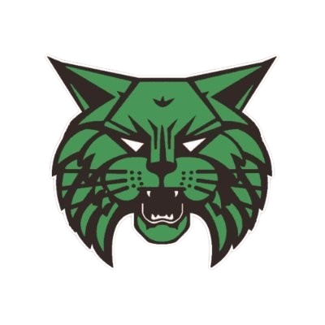 I worked making data products at a research institute at the [University](https://data-bniajfi.opendata.arcgis.com/) of Baltimore  , contributed to Ethereum-based projects like [Voxels](https://voxels.com) , co-founded [Addy-AI](https://addy-ai.com) , and currently teach at [Anne Arundel Community College](https://aacc.com/). Go RiverHawks! 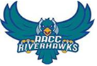.

### My Specialties Include:

- Teaching
- Full Stack Development 
- Process Automation
- Data Analytics
- AI & ML   
- Web3 
---

## Featured Project: [Langdrive](https://docs.langdrive.ai/docs/getting-started)

<table align="center"> 
  <tr> 
    <td align="center" colspan="2">
      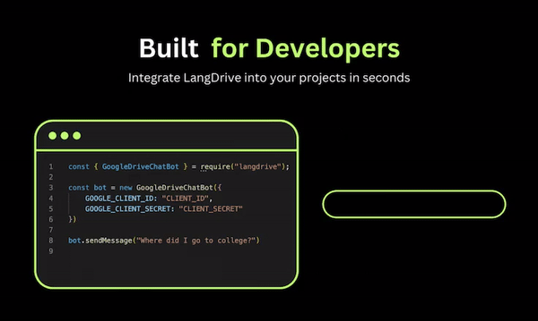
    </td>
  </tr>
  <tr>
    <td align="left">
      <strong>RAG based AI Chatbots w/ 100+ GitHub Stars</strong>
    </td> 
    <td align="center">
      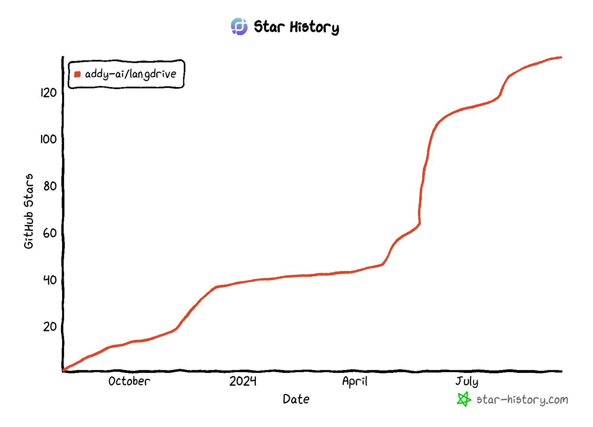
    </td>
  </tr>
</table>

## Past Works: 

  

    
      
      
     
    <b style='font-size:18px;'>Addy AI</b>
  

  <table align="center"> 
    <tr>
      <td>
        As CTO and technical co-founder at <a href='https://addy.so/chrome-extension'>Addy-AI</a>, we generated AI products which garnered over 10k+ users and accrued $400k in support from programs like 
        , two accelerators (Github, CMU), and a whole crew of amazing, supporting investors. Codebase mostly private.
      </td>
      <td align="center">
        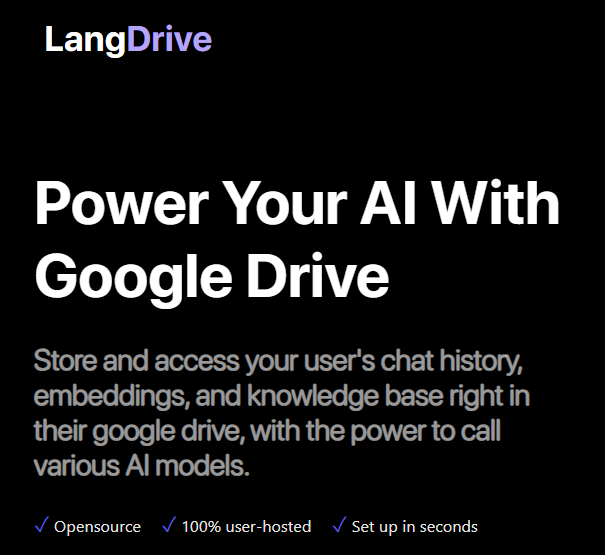 
        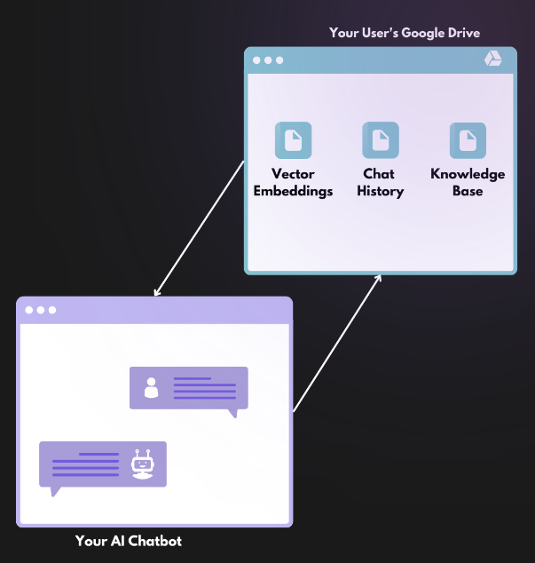
      </td>
    </tr> 
    <tr> 
      <td align="center" colspan="2">
        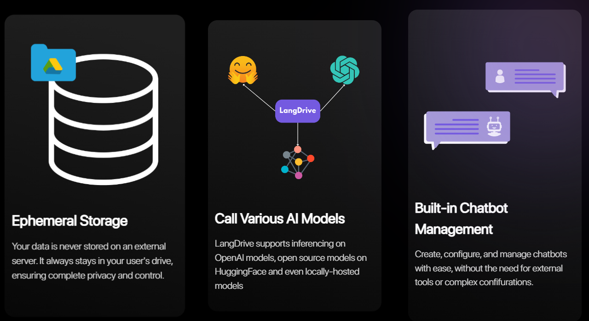
      </td>
    </tr>
  <tr> 
   <td align="center" colspan="2">
    Github - 2024
  </td>  </tr> 
  <tr> 
   <td align="center" colspan="2">
    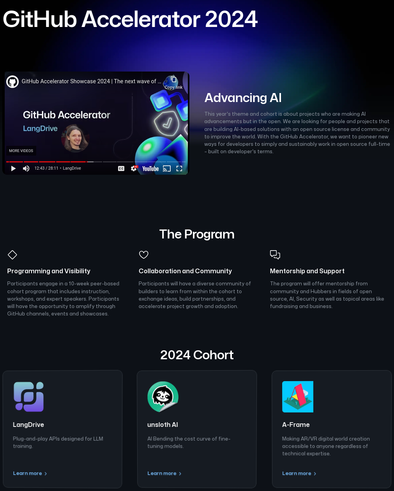   
  </td>  </tr> 
  <tr> 
   <td align="center" colspan="2">
    Venture Bridge - 2023
  </td>  </tr> 
  <tr> 
   <td align="center" colspan="2">
    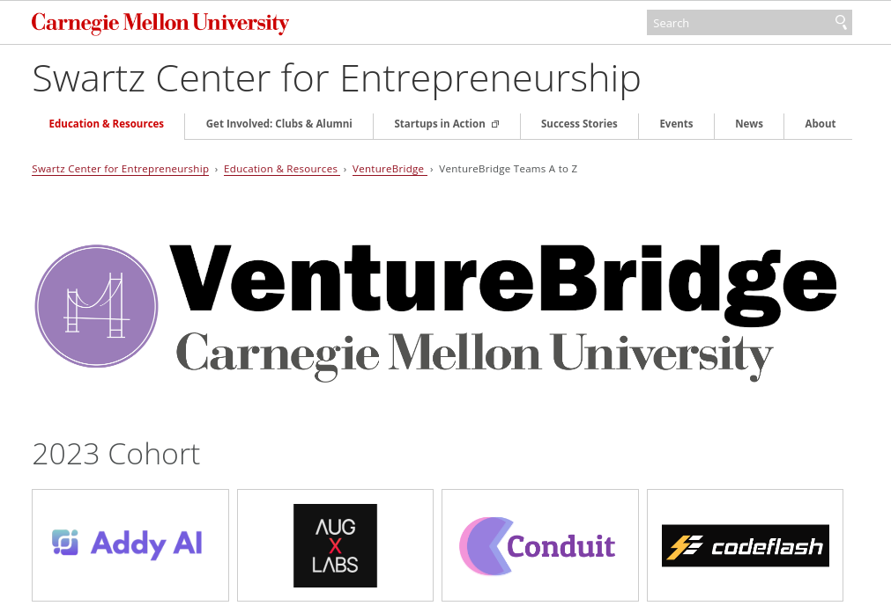
  </td>  </tr>  
  </table> 

 

  

    
    <b style="font-size:18px;">Voxels</b>
  

  <table align="center"> 
    <tr>
      <td>
        Voxels Virtual Village: This is a picture of <a href='https://www.voxels.com/play?coords=N@1447E,1128S'>my home</a> in the ethereum based metaverse. While there, I led efforts to squash bugs and redesign the site. I also added a few cool features like support for livestreams, HLS .m3u8 files, and sending money in-game. Codebase private. 
      </td>
      <td align="center">
        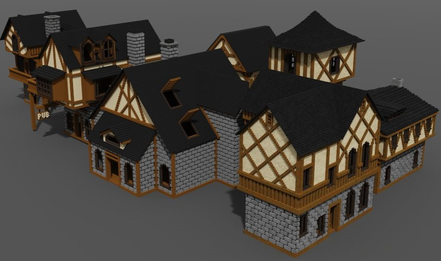
      </td>
    </tr>
  </table>

  

     
    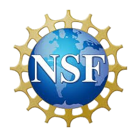 
    <b style="font-size:18px;">Data Science Corps</b>
  
 
<table align="center">
  <tr>
    <td align='center' colspan="2">
      <a href='https://www.youtube.com/watch?v=sWKrTzY8yQ4'>
        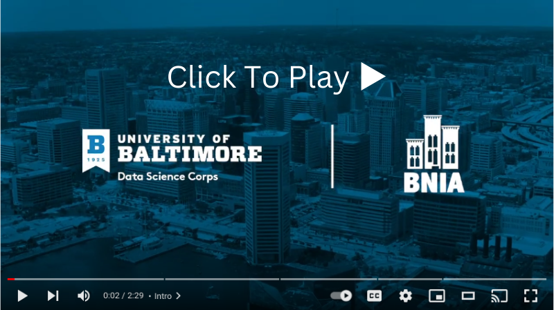
      </a>
       <em>Introductory video for the Data Science Corps</em>
    </td>
  </tr>
  <tr>
    <td>
      Under a National Science Foundation grant I taught 'Programming with Big Data' to a Data Science Corps comprised of graduate students from participating institutions from the University System of Maryland.
    </td>
    <td align="center">
      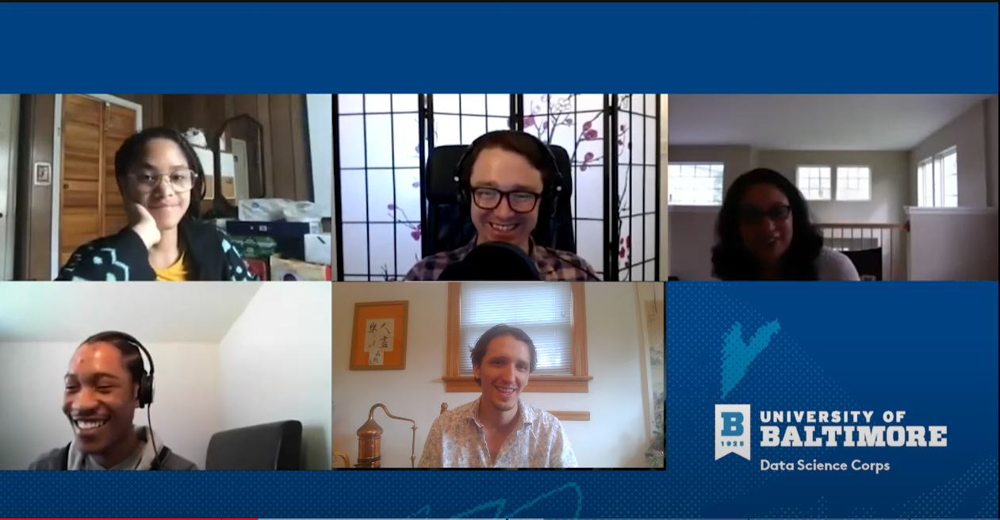
       <em>Zoom Meeting</em>
    </td>
  </tr> 
</table>
<table align="center">
  <tr>
    <td align="center" colspan="2">
      I also mentored students through various research projects. A few final reports are shown below:
    </td>
  </tr>
  <tr> 
    <td align="center">
      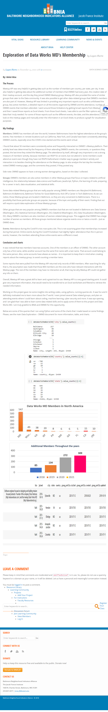
       <em>Project: Exploration of Data Works Membership</em>
    </td>
    <td align="center">
      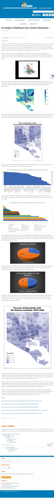
       <em>Project: Analysis of Baltimore City E-Scooter Distribution</em>
    </td>
    <td align="center">
      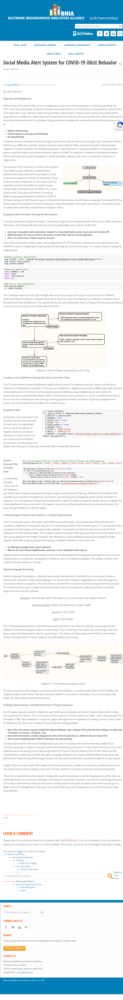
       <em>Project: Social Media Alert System for COVID-19 Illicit Behavior</em>
    </td>
  </tr>
</table>

  

     
    
    <b style="font-size:18px;">BNIA</b>
  

  <table align="center"> 
    <tr>
      <td>
        <strong>Title:</strong> The Baltimore Neighborhood Indicator Association, Jacob France Institute's (BNIA-JFI) Homepage 
        <strong>Description:</strong> I inherited this website and built it out over the years. Each year we recieved ~50 administrative data sources and produced 150 quality of life indicators form it that we called <a href='https://vital-signs-bniajfi.hub.arcgis.com/'>Vital Signs</a>. I was responsible for data injestion, processing, and dissemination. 
         
        

           
          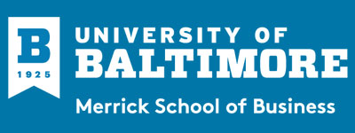
           
           
        
 
      </td>
      <td align="center">
        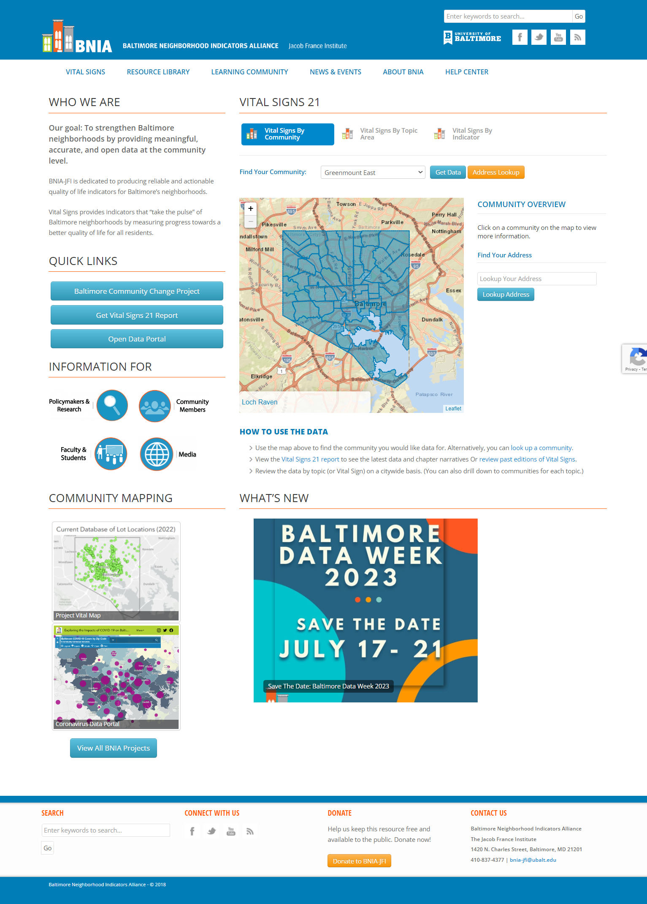
      </td>
    </tr>
    <tr>
      <td>
        <strong>Title:</strong> Community Guidepost 
        <strong>Description:</strong> A longitudinal neighborhood data visualizer built in collaboration with innovation works.
         
        

           
          
        
 
      </td>
      <td align="center">
        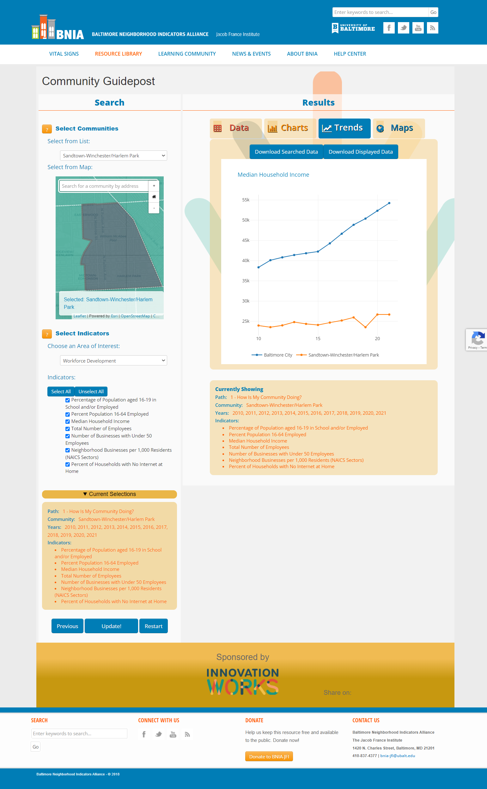
      </td>
    </tr>
    <tr>
      <td>
        <strong>Title:</strong> Internal Tools 
        <strong>Description:</strong> To aid development, a suite of tools were made. 
      </td>
      <td align="center">
          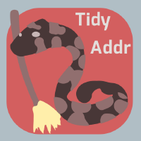
          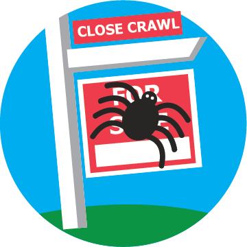  
      </td>
    </tr>
    <tr>
      <td>
        <strong>Title:</strong> Mayors Office of Information Technology 
        <strong>Description:</strong> We had a strong working relation with several of the mayors offices. I did some contract development for them (which can not be shown) and we helped set up <a href='https://data.baltimorecity.gov/'>their</a> open data portal, and more.
        

           
          
        
 
      </td>
      <td align="center"> 
          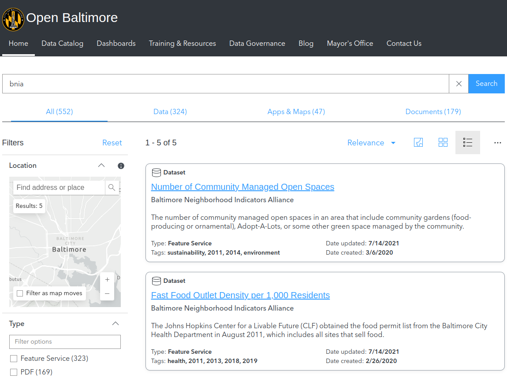
      </td>
    </tr>
  </table>

 

  

    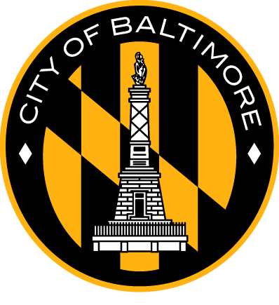
    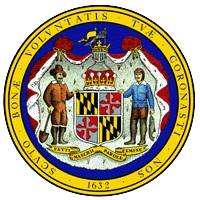 
    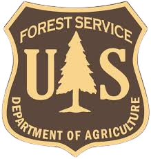  
    <b style='font-size:18px;'>Contracted (Federal, State, Local)</b>
  

  <table align="center">
    <tr>
      <td>
        <strong>Title:</strong> Green Patterns Map 
        <strong>Description:</strong> A web-based map application to visualize longitudinal water usage throughout Baltimore City, aiding city-wide environmental and planning decisions.
        

           
          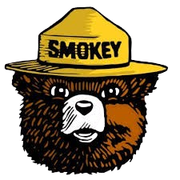
          
          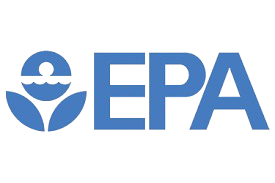
          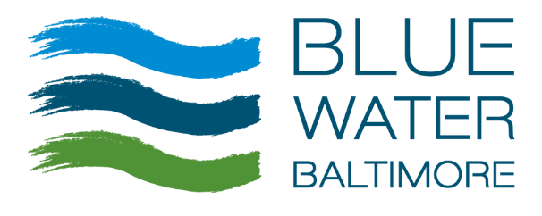
        
 
      </td>
      <td align="center">
        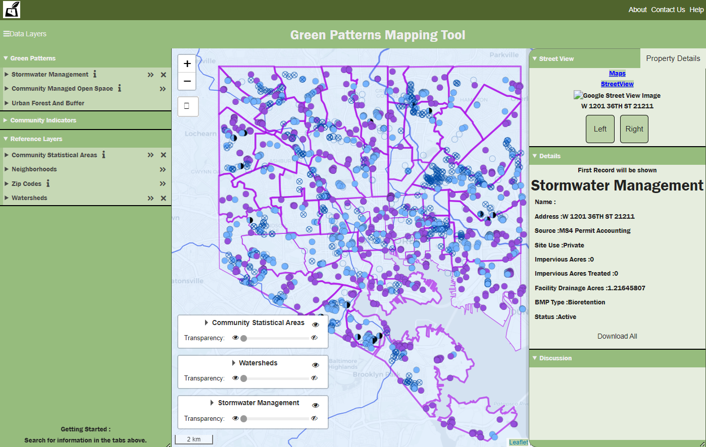
      </td>
    </tr>
    <tr>
      <td>
        <strong>Title:</strong> State of Maryland, Dept. Labor Dashboard 
        <strong>Description:</strong> Updated quarterly and hosted on the official departments' website
        

           
           
        
 
      </td>
      <td align="center">
        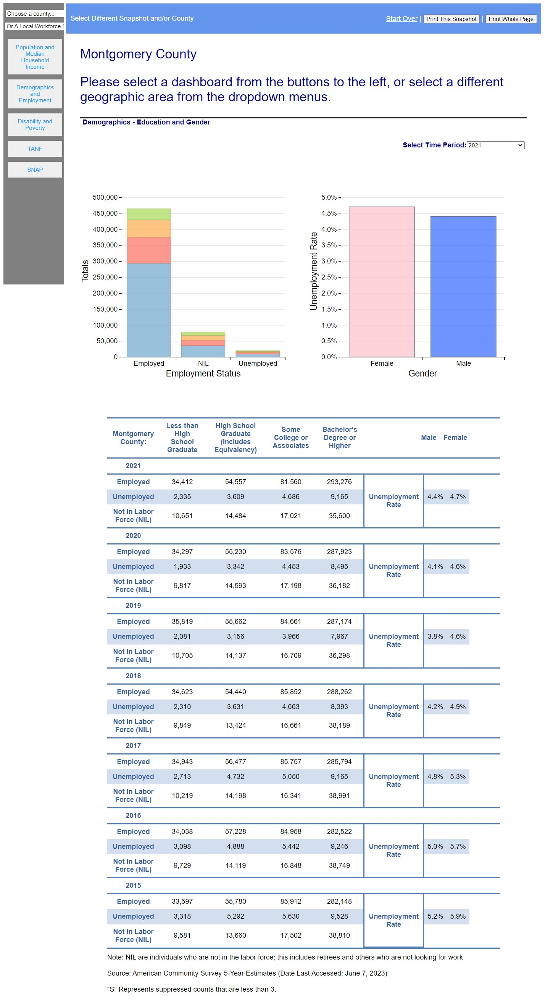
      </td> 
    </tr>
    <tr>
      <td>
        <strong>Title:</strong> Baltimore Open Land Data 
        <strong>Description:</strong> This application streamlines data collection and analysis for stakeholders working to revitalize Baltimore’s neighborhoods by providing insights into vacancy and foreclosure trends. It is designed to support informed decision-making for community redevelopment efforts.
        

           
          
        
 
      </td>
      <td align="center">
        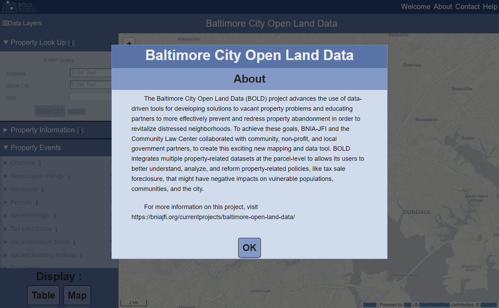
      </td>
    </tr>
    <tr>
      <td>
        <strong>Title:</strong> Business Integration Partnership 
        <strong>Description:</strong> A portal to search for minority business, sponsored by an org of the same name.
        

           
           
        
 
      </td>
      <td align="center">
        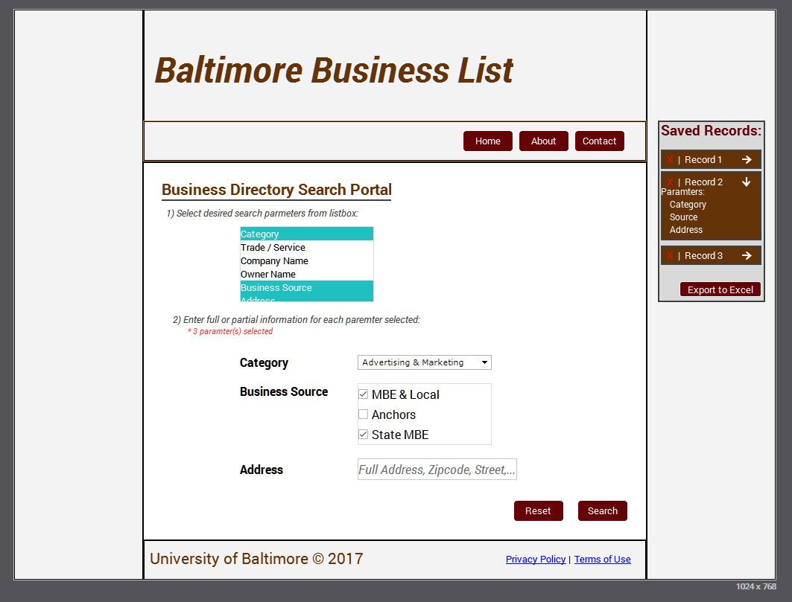
      </td>
    </tr>
  </table>

 

  

    
    <b>Personal</b>
  

  <table align="center">
    <tr>
      <td>
        <strong>Title:</strong> Dynamically Generated Map 
        <strong>Description:</strong> A dynamically generated map using census data; code available on <a href='https://observablehq.com/@karpatic'>ObservableHQ</a>.
      </td>
      <td align="center">
        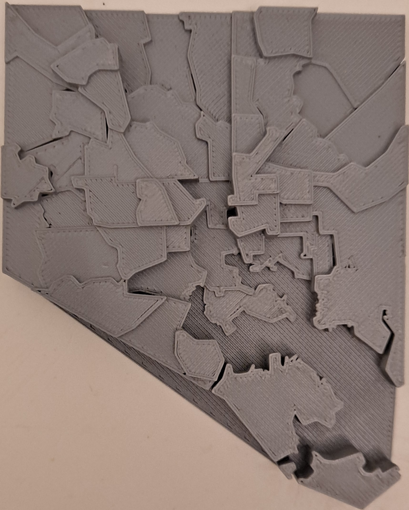
      </td>
    </tr>
    <tr>
      <td>
        <strong>Title:</strong> Interactive Lighting Effects 
        <strong>Description:</strong> Lighting effects built using web-based technologies with interactive features.
      </td>
      <td align="center">
        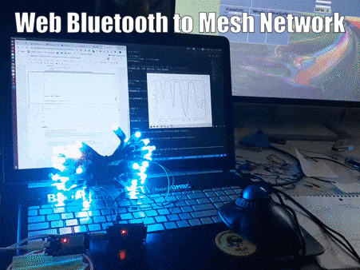
      </td>
    </tr>
  </table>

 

---

## 📫 Let's Connect! 

<table align="center">
  <tr>
    <td align="center">
      
    </td>  
    <td align="center">
      
    </td>   
  </tr> 
  <tr>
    <td align="center" colspan="2" > 
      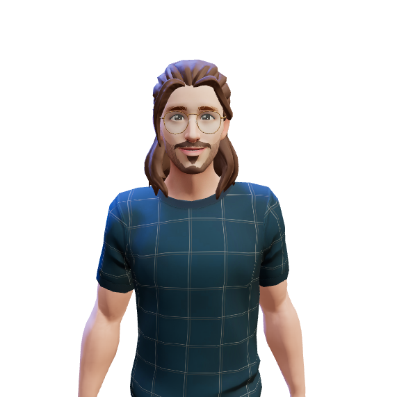 
    </td>    
  </tr> 
</table>   
